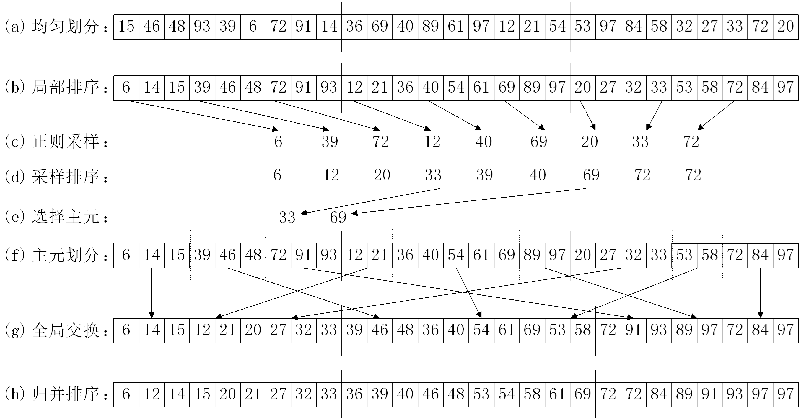

# PJ-2 内存不共享多机环境下Parallel sorting by regular sampling算法
这个实验我们使用C++和MPI实现Parallel sorting by regular sampling算法。

## 实现
PSRS算法的简单示意图如下所示。


我们的实现分为4步:
1. 均匀划分+局部快速排序+正则采样
2. 归并排序正则采样数据+正则采样
3. 数据分区+分区合并
4. 归并排序

## Step1:均匀划分+局部快速排序+正则采样
在这一步中，我们利用MPI\_Scatter进行均匀划分，每一个进程获得自己需要局部排序的数据，并进行局部快速排序，最后通过正则采样采集nprocs个主元。
```cpp
// 均匀划分
MPI_Scatter(arr,mySize,MPI_INT,myArr,mySize,MPI_INT,0,MPI_COMM_WORLD);
// 局部快速排序
sort(myArr,myArr+mySize);
// 正则采样
for(int i=0;i<nprocs;i++)
sampled_pivots[i]=myArr[mySize/nprocs*i];
```

## Step2:归并排序正则采样数据+正则采样
在这一步中，我们创建了一个数组，在根进程中接受每一个进程正则采样得到的主元，并对合起来的数组进行正则采样，最后通过MPI\_Bcast广播给所有进程。
```cpp
// 归并排序正则采样数据
int *merged_pivots=new int[nprocs*nprocs];  // 每个划分正则采样合起来的数组
MPI_Gather(sampled_pivots,nprocs,MPI_INT,merged_pivots,nprocs,MPI_INT,0,MPI_COMM_WORLD);
if(myId == 0){
int *merged_pivots_2=new int[nprocs*nprocs]; // 放排好序的数组
int *offset=new int[nprocs]; //存放指针偏移量
memset(offset,0,sizeof(int)*nprocs);     // 清零
for(int i=0;i<nprocs*nprocs;i++){
int cur_min=INT_MAX; // 当前循环最小值
int proc_id=-1;  // 当前循环最小值所属分区号
for(int j=0;j<nprocs;j++){
    if((offset[j]<nprocs) & (merged_pivots[j*nprocs+offset[j]]<=cur_min)){
        cur_min=merged_pivots[j*nprocs+offset[j]];
        proc_id=j;
    }
}
merged_pivots_2[i]=cur_min;
offset[proc_id]+=1;
}
// 正则采样  
for(int i=0;i<nprocs-1;i++)
sampled_pivots_2[i]=merged_pivots_2[(i+1)*nprocs];
delete []merged_pivots_2;
delete []offset;
delete []merged_pivots;
}
MPI_Bcast(sampled_pivots_2,nprocs-1,MPI_INT,0,MPI_COMM_WORLD); 
```


## Step3:数据分区+分区合并
在这一步中，我们计算每个进程根据选取的主元得到的每个划分的分区大小，利用MPI\_Alltoall广播需要从每个进程接受的数组大小，并计算接收数组长度之和。然后我们创建一个长度符合要求的数组，计算发送缓冲区和接收缓冲区中每个数据块起始位置的偏移量，并利用MPI\_Alltoallv进行分区合并。
```cpp
// 数据分区
int proc_id=0;  // 分区所属proc
int* sendcounts=new int[nprocs]; // 当前进程要发送给其他进程的数据块大小，第i个元素表示当前进程要发送给第i个进程的数据块大小
memset(sendcounts,0,sizeof(int)*nprocs);     // 分区长度清零
for(int i=0;i<mySize;i++){
while (proc_id<nprocs-1 & myArr[i]>sampled_pivots_2[proc_id]) 
proc_id+=1;     // 找到当前i所属的分区
if(proc_id==nprocs-1){     
sendcounts[nprocs-1]=mySize-i;    // 最后一个分区大小
break;
}
sendcounts[proc_id]++;     //i归入所属分区，分区大小+1
}
// 得到需要从每个进程接受的数组大小
MPI_Alltoall(sendcounts,1,MPI_INT,recvcounts,1,MPI_INT,MPI_COMM_WORLD);
for(int i=0;i<nprocs;i++) 
*mySize2+=recvcounts[i];
*myArr2=new int[*mySize2];
// 计算发送缓冲区和接收缓冲区中每个数据块起始位置的偏移量
int *sdispls=new int[nprocs];//表示发送缓冲区中每个数据块的偏移量,第i个元素表示当前进程要发送给第i个进程的数据块在发送缓冲区中的起始位置
sdispls[0]=0; 
rdispls[0]=0;
for(int i=1;i<nprocs;i++){
sdispls[i]=sendcounts[i-1]+sdispls[i-1];
rdispls[i]=recvcounts[i-1]+rdispls[i-1];
}
// 分区合并
MPI_Alltoallv(myArr,sendcounts,sdispls,MPI_INT,*myArr2,recvcounts,rdispls,MPI_INT,MPI_COMM_WORLD);
delete []sdispls;
delete []sendcounts;
```


## Step4:归并排序
在这一步中，每个进程对自己nprocs个已经排好序的数组进行归并排序，然后计算根进程的接收缓冲区中每个数据块的偏移量，并利用MPI\_Gatherv收集排序好的数组到根进程。
```cpp
// 计算每个分区结尾位置+1的位置
int* myPartEnd=new int[nprocs]; 
for(int i=1;i<nprocs;i++)
myPartEnd[i-1]=rdispls[i];
myPartEnd[nprocs-1]=mySize2;
// 归并排序
int* mySortedArr2=new int[mySize2];
for(int i=0;i<mySize2;i++){
int cur_min=INT_MAX; // 当前循环最小值
int proc_id=-1;  // 当前循环最小值所属分区号
for(int j=0;j<nprocs;j++){
if((rdispls[j]<myPartEnd[j]) & (myArr2[rdispls[j]]<=cur_min)){
    cur_min=myArr2[rdispls[j]];
    proc_id=j;
}
}
mySortedArr2[i]=cur_min;
rdispls[proc_id]+=1;
}
delete []myPartEnd;
// 收集排序好的数组到根进程
int* recvbuf=new int[nprocs];  //指向根进程的缓冲区的指针,存放所有进程发送的子列表大小
MPI_Gather(&mySize2,1,MPI_INT,recvbuf,1,MPI_INT,0,MPI_COMM_WORLD);
// 计算根进程的接收缓冲区中每个数据块的偏移量
if(myId == 0){
rdispls[0]=0;
for(int i=1;i<nprocs;i++)
rdispls[i]=recvbuf[i-1]+rdispls[i-1];
}
MPI_Gatherv(mySortedArr2,mySize2,MPI_INT,arr,recvbuf,rdispls,MPI_INT,0,MPI_COMM_WORLD);
delete []mySortedArr2;
delete []recvbuf;
```

## 实验方法
我们同样使用chrono库进行微秒级定时，并跑500次取平均。对于多进程，我们使用MPI\_Reduce获取用时最长进程的耗时以得到正确的耗时。
```cpp
MPI_Reduce(&time_cost_parallel,&maxTime,1,MPI_DOUBLE,MPI_MAX,
           0,MPI_COMM_WORLD);
  ```
我们观察到在nprocs等于16时，只利用根进程进行快速排序时与不用mpi的环境中进行串行排序时间差距较大，因此我们另外使用一个不用mpi编程的串行排序作为基准计算加速比。

请确保已安装MPICH/OpenMPI,如果未安装可通过以下命令进行安装
```terminal
sudo apt-get install mpich
```

可以通过如下代码进行编译
```terminal
mpic++ -o lab2-test lab2-test.cpp
g++ -o lab2-base lab2-base.cpp
```

可以通过如下代码启动测试：
```bash
bash lab2.sh
```

## 实验环境
我们的实验环境如下图所示。
| 项目               | 详情              |
|--------------------|-------------------|
| CPU                | AMD Ryzen 7 5800H |
| Core               | 8                 |
| Thread(s) per core | 2                 |
| Mem                | 16 GB             |
| OS                 | Ubuntu 20.04.1    |
| MPICH Version      | 4.0               |

## 结果
我们测试了程序在1K、5K、10K、100K、1M、10M等不同数据量以及在2、4、8、16个线程数情况下的加速比，实验结果如下。
|        | 1K   | 5K   | 10K  | 100K | 1M   | 10M  |
|--------|------|------|------|------|------|------|
| 2线程   | **0.76** | 1.33 | 1.41 | 1.35 | 1.60 | 1.87 |
| 4线程   | 0.47 | **1.64** | **2.17** | 2.03 | 3.02 | 3.41 |
| 8线程   | 0.15 | 0.70 | 1.26 | **2.50** | 3.91 | 4.67 |
| 16线程 | 0.05 | 0.28 | 0.38 | 1.61 | **4.18** | **5.00** |

从以上结果，我们可以得到如下结论：
1. 在实验测试的数据量下，固定线程数，加速比随着数据量的增加而增加，这说明并行程序的额外开销不可忽视。
2. 在数据量较小的时候，串行算法本身就已经足够快速，而并行算法额外的启动以及通信等一系列开销使得并行算法比串行算法还慢。这一问题随着线程数增加更为明显。
3. 并行算法最大加速比对应的线程数随着数据量的增加而增加。这说明了增大数据量才能更好地抵消更多线程所带来的额外开销。
4. 在数据量较大的时候，并行算法展现出了非常大的优势，在16线程、10M数据量的情况下，加速比甚至达到了5。此外，PSRS算法的效率也很高，在2/4线程、10M数据量下，加速比十分接近于线程数，这说明了选取合适主元的重要性。
